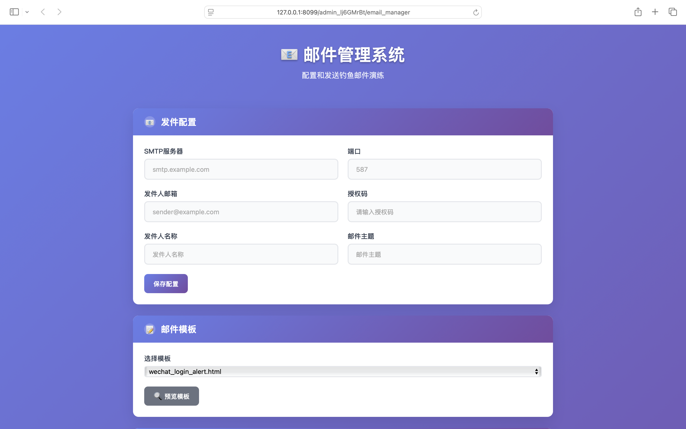
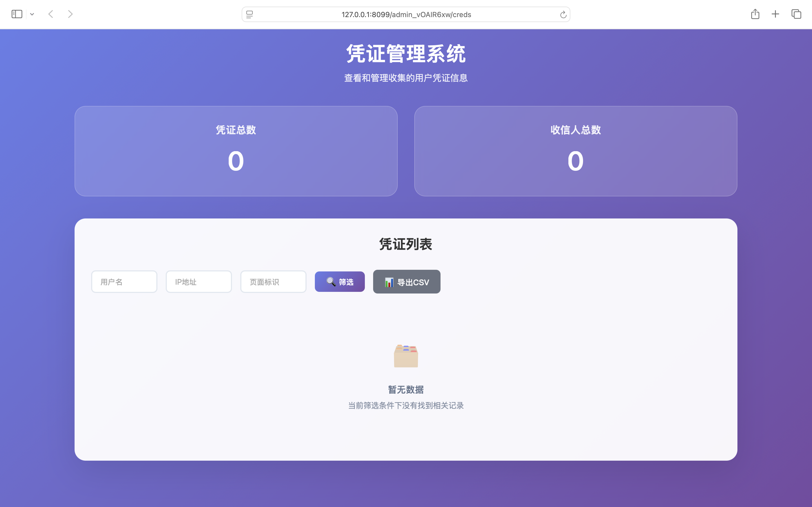
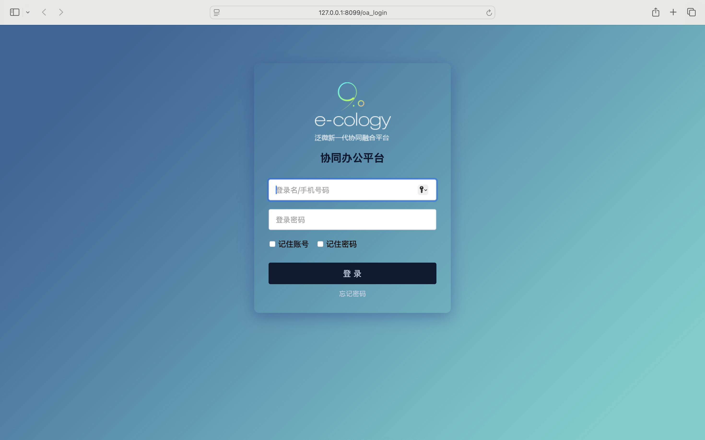

# 🎣 Onl## 📸 界面预览

| 邮件管理 | 凭证管理 | 钓鱼页面 |
|---------|---------|---------|
|  |  |  |

##  项目简介

OnlyFish 是一个现代化的钓鱼邮件演练平台，专为企业网络安全意识培训设计。采用紫色渐变UI，提供邮件发送、数据收集、结果分析的完整流程。

## ✨ 核心功能

- **📧 邮件管理**：多模板支持、实时预览、批量导入、SMTP配置
- **🗂️ 凭证管理**：数据统计、智能筛选、批量操作、CSV导出  
- **🎨 现代界面**：响应式设计、卡片布局、用户友好鱼邮件演练平台


> 一个专业的钓鱼邮件演练平台，用于企业安全意识培训

##  项目简介

OnlyFish 是一个现代化的钓鱼邮件演练平台，专为企业网络安全意识培训设计。采用紫色渐变UI，提供邮件发送、数据收集、结果分析的完整流程。

## ✨ 核心功能

- **📧 邮件管理**：多模板支持、实时预览、批量导入、SMTP配置
- **🗂️ 凭证管理**：数据统计、智能筛选、批量操作、CSV导出  
- **� 现代界面**：响应式设计、卡片布局、用户友好

## 🚀 快速开始

```bash
# 1. 克隆项目
git clone https://github.com/EVILELLY/Only-Fish.git
cd Only-Fish

# 2. 安装依赖
pip install -r requirements.txt

# 3. 启动服务
python run.py --port 8080

# 4. 访问管理页面（终端会显示具体链接）
```

## 📸 界面预览

| 邮件管理 | 凭证管理 | 钓鱼页面 |
|---------|---------|---------|
|  |  |  |

## ⚙️ 配置说明

### SMTP 配置
在邮件管理界面配置：服务器地址、端口(587/465)、发件人邮箱、授权码

### 自定义密钥（可选）
```bash
# 生成新密钥
python -c "import secrets; print(secrets.token_hex(32))"
# 修改 app/config.py 中的 SECRET_KEY
```

## 🚀 生产部署

### Gunicorn 部署
```bash
# 安装 Gunicorn
pip install gunicorn

# 启动应用
gunicorn -w 4 -b 127.0.0.1:8080 run:app
```

### Nginx 配置
```nginx
server {
    listen 80;
    server_name your-domain.com;
    
    location / {
        proxy_pass http://127.0.0.1:8080;
        proxy_set_header Host $host;
        proxy_set_header X-Real-IP $remote_addr;
        proxy_set_header X-Forwarded-For $proxy_add_x_forwarded_for;
    }
}
```

## 🛡️ 安全提示

> **⚠️ 重要提醒**
> 
> - **仅限内部使用**：禁止用于非法用途
> - **获得授权**：演练前需获得相关授权
> - **数据保护**：及时清理演练数据
> - **内网部署**：避免暴露在公网

## 🤝 贡献

欢迎提交 Issue 和 Pull Request！

## 📄 开源协议

- ✅ **允许**：学习、研究、内部安全培训
- ❌ **禁止**：商业用途、恶意攻击、未授权测试

---

**⭐ 如果对您有帮助，请给个 Star 支持！**
